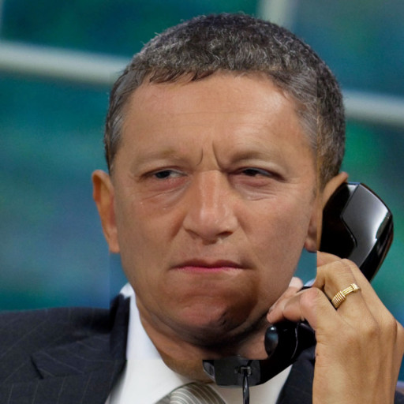
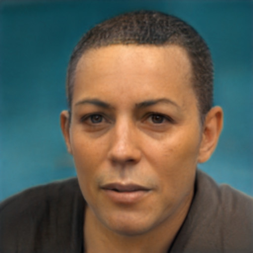
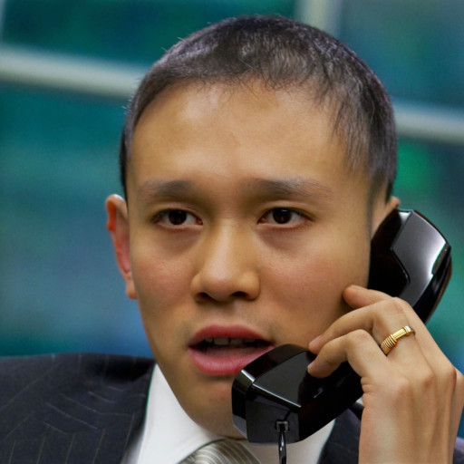
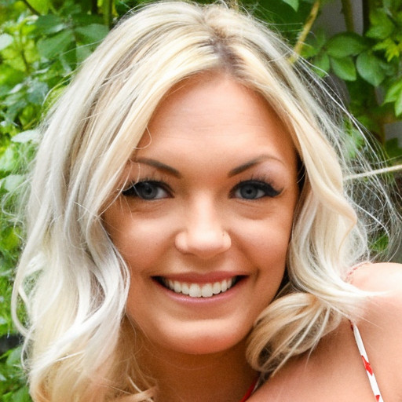
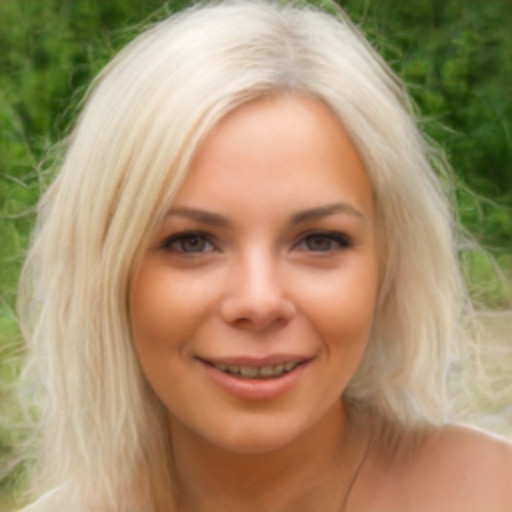
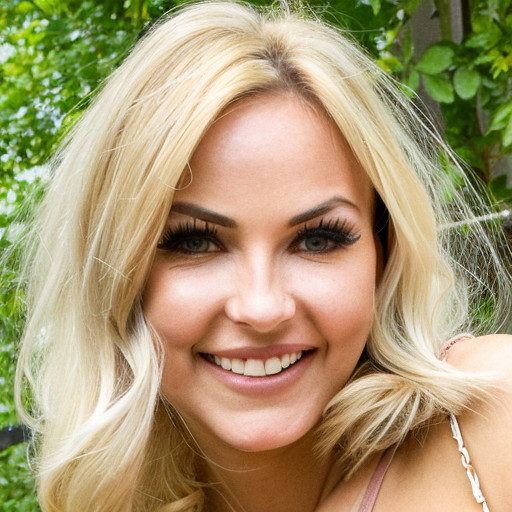
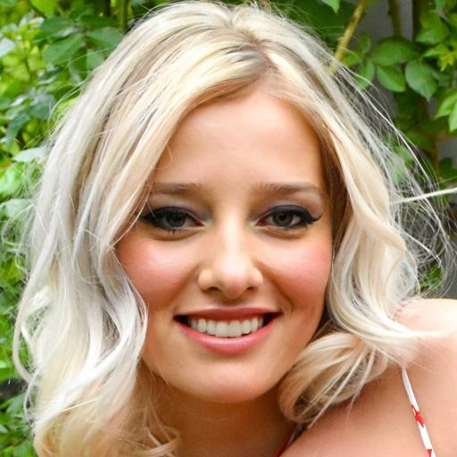
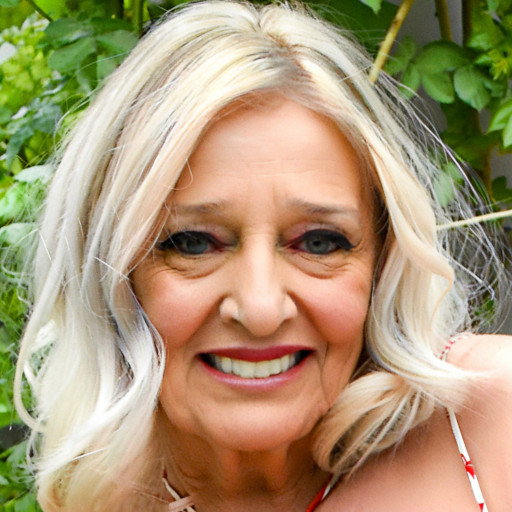
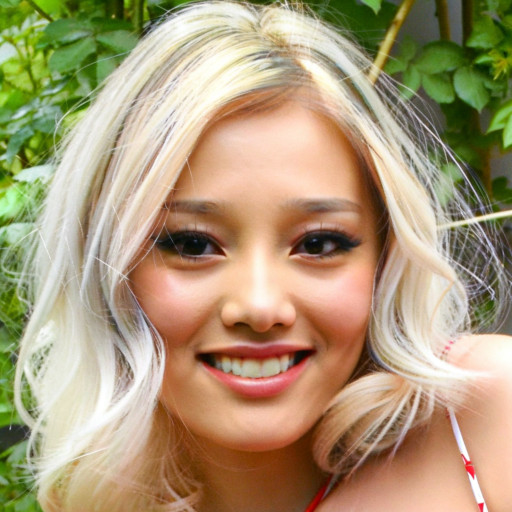

<div align="center">

<h1>Reverse Personalization</h1>

[Han-Wei Kung](https://hanweikung.github.io/)<sup>1</sup> · [Tuomas Varanka](https://scholar.google.com/citations?user=5QWyHT4AAAAJ&hl=en)<sup>2</sup> · [Nicu Sebe](https://scholar.google.com/citations?user=stFCYOAAAAAJ&hl=en)<sup>1</sup>

<sup>1</sup> University of Trento, Italy | <sup>2</sup> University of Oulu, Finland

[](https://arxiv.org/abs/2512.22984) [](https://hanweikung.github.io/reverse-personalization/) [](https://wacv.thecvf.com/Conferences/2026)

<table>
  <thead>
    <tr>
      <th align="center">Input</th>
      <th align="center">LDFA</th>
      <th align="center">RiDDLE</th>
      <th align="center">Textual Inv.</th>
      <th align="center" colspan="3"><strong>Ours</strong></th>
    </tr>
  </thead>
  <tbody>
    <tr>
      <td></td>
      <td></td>
      <td></td>
      <td></td>
      <td></td>
      <td></td>
      <td></td>
    </tr>
    <tr>
      <td></td>
      <td></td>
      <td></td>
      <td></td>
      <td></td>
      <td></td>
      <td></td>
    </tr>
    <tr>
      <td align="left"><sub>ID anonymized</sub></td>
      <td align="center">✅</td>
      <td align="center">✅</td>
      <td align="center">✅</td>
      <td align="center" colspan="3">✅</td>
    </tr>
    <tr>
      <td align="left"><sub>Subject agnostic</sub></td>
      <td align="center">✅</td>
      <td align="center">✅</td>
      <td align="center">❌</td>
      <td align="center" colspan="3">✅</td>
    </tr>
    <tr>
      <td align="left"><sub>Attr &amp; scene kept</sub></td>
      <td align="center">❌ Poor</td>
      <td align="center">❌ Poor</td>
      <td align="center">✅ Good</td>
      <td align="center" colspan="3">✅ Good</td>
    </tr>
    <tr>
      <td align="left"><sub>Attr controllable</sub></td>
      <td align="center">❌</td>
      <td align="center">❌</td>
      <td align="center">❌</td>
      <td align="center">✅ Default</td>
      <td align="center">✅ Aging</td>
      <td align="center">✅ Ethnicity</td>
    </tr>
  </tbody>
</table>

</div>

Our reverse personalization method anonymizes faces without subject fine-tuning, while preserving the original facial attributes and surrounding scene. It also supports intuitive control over which attributes are retained or modified.

## Table of Contents

- [Architecture Overview](#architecture-overview)
- [Installation](#installation)
- [Usage](#usage)
  - [Basic Example - Aligned Face Input](#basic-example---aligned-face-input)
  - [Example - Unaligned Face Input with Multiple Faces](#example---unaligned-face-input-with-multiple-faces)
  - [Advanced Configuration with Attribute Control](#advanced-configuration-with-attribute-control)
  - [Running the Example Script](#running-the-example-script)
- [Configuration Parameters](#configuration-parameters)
- [Project Structure](#project-structure)
- [How It Works](#how-it-works)
- [Citation](#citation)
- [Acknowledgments](#acknowledgments)

## Architecture Overview

The pipeline consists of four main stages:

```
┌─────────────────┐
│  Input Image    │
└────────┬────────┘
         │
         ▼
┌─────────────────────────────┐
│  Face Detection & Alignment │  ← 1. Face Alignment (SFD detector)
│  (utils/extractor.py)       │
└────────┬────────────────────┘
         │
         ▼
┌─────────────────────────────┐
│  Face Embedding Extraction  │  ← 2. ArcFace (InsightFace's buffalo_l model)
│  (utils/face_embedding.py)  │
└────────┬────────────────────┘
         │
         ▼
┌─────────────────────────────┐
│  DDPM Inversion Process     │  ← 3a. Stable Diffusion XL + LEDITS++
│  (sdxl/leditspp/)           │
└────────┬────────────────────┘
         │
         ▼
┌─────────────────────────────┐
│  Guided Image Generation    │  ← 3b. IP-Adapter-FaceID
│  (with anonymized identity) │
└────────┬────────────────────┘
         │
         ▼
┌─────────────────────────────┐
│  Face Merging               │  ← 4. Image composition
│  (utils/merger.py)          │
└────────┬────────────────────┘
         │
         ▼
┌─────────────────┐
│  Output Image   │
└─────────────────┘
```

### Component Breakdown

1. **Face Extraction Layer** (`utils/extractor.py`)
   - Detects faces using face_alignment library
   - Computes transformation matrices for face alignment
   - Extracts face regions at specified resolution

2. **Identity Embedding Layer** (`utils/face_embedding.py`)
   - Extracts identity embeddings using ArcFace
   - Creates identity and null identity embedding pairs

3. **Diffusion Model Layer** (`sdxl/leditspp/`)
   - Custom SDXL pipeline with LEDITS++ editing capabilities
   - DPM-Solver++ multistep scheduler with injection
   - Inversion and generation with IP-Adapter integration

4. **Composition Layer** (`utils/merger.py`)
   - Warps generated faces back to original image coordinates

## Installation

1. **Clone the repository**
   ```bash
   git clone https://github.com/hanweikung/reverse-personalization.git
   cd reverse-personalization
   ```

2. **Create and activate the conda environment**
   ```bash
   conda env create -f environment.yml
   conda activate reverse-personalization
   ```

3. **Download models** (automatic on first run)
   - Stable Diffusion XL: `stabilityai/stable-diffusion-xl-base-1.0`
   - IP-Adapter-FaceID: `h94/IP-Adapter-FaceID`
   - InsightFace models (buffalo_l): Downloaded to `~/.insightface`

   Ensure you have sufficient disk space (~15GB) and internet connectivity.

## Usage

### Basic Example - Aligned Face Input

For images with a single, already aligned face (e.g., from [FFHQ](https://github.com/NVlabs/ffhq-dataset) or [CelebA-HQ](https://github.com/tkarras/progressive_growing_of_gans) datasets):

```python
from anonymize_faces_in_image import anonymize_faces_in_image

def main():
    # Path to your input image (already aligned face)
    input_image_path = "path/to/aligned_face.jpg"
    
    # Run anonymization (enable_face_detection=False by default)
    anonymized_image = anonymize_faces_in_image(
        input_image=input_image_path,
    )
    
    # Save the result
    anonymized_image.save("output_anonymized.png")
    
    # Or display it
    # anonymized_image.show()

if __name__ == "__main__":
    main()
```

### Example - Unaligned Face Input with Multiple Faces

For images containing unaligned faces or multiple people:

```python
from anonymize_faces_in_image import anonymize_faces_in_image

def main():
    # Path to your input image with unaligned faces
    input_image_path = "path/to/image_with_people.jpg"
    
    # Run anonymization with face extraction and alignment enabled
    anonymized_image = anonymize_faces_in_image(
        input_image=input_image_path,
        enable_face_detection=True,  # Enable face detection and alignment
    )
    
    # Save the result
    anonymized_image.save("output_anonymized.png")

if __name__ == "__main__":
    main()
```

### Advanced Configuration with Attribute Control

For fine-tuned control over the anonymization process:

```python
anonymized_image = anonymize_faces_in_image(
    input_image="input.jpg",
    attribute_prompt="an old man",   # Control face attributes
    sd_model_path="stabilityai/stable-diffusion-xl-base-1.0",
    insightface_model_path="~/.insightface",
    
    # GPU Configuration
    device_num=0,                    # GPU device ID
    
    # Diffusion Model Parameters
    skip=0.7,                        # Skip fraction of diffusion timesteps (0.0-1.0)
    num_inversion_steps=100,         # Number of DDPM inversion steps
    guidance_scale=-10.0,            # Negative guidance for anonymization
    
    # Face Processing
    enable_face_detection=False,     # Enable face extraction/alignment for unaligned images
    face_image_size=1024,            # Resolution of extracted face region (used when enable_face_detection=True)
    det_thresh=0.1,                  # Face detection confidence threshold
    det_size=640,                    # Face detection model input size
    
    # Identity Control
    id_emb_scale=1.0,                # Identity embedding scale factor
    ip_adapter_scale=1.0,            # IP-Adapter influence strength
    
    # Reproducibility
    seed=0,                          # Random seed
)
```

### Running the Example Script

```bash
python main.py
```

This will process the default image at `my_dataset/images/00080.png` and save the result as `output.png`.

## Configuration Parameters

| Parameter | Type | Default | Description |
|-----------|------|---------|-------------|
| `input_image` | str/Path | Required | Path to input image file |
| `attribute_prompt` | str/None | `None` | Prompt for controlling face attributes (e.g., "a young woman") |
| `sd_model_path` | str | `"stabilityai/stable-diffusion-xl-base-1.0"` | Hugging Face model ID or local path |
| `insightface_model_path` | str | `"~/.insightface"` | Path to InsightFace models |
| `device_num` | int | `0` | CUDA device number (GPU ID) |
| `skip` | float | `0.7` | Fraction of diffusion timesteps to skip (0.0-1.0) |
| `id_emb_scale` | float | `1.0` | Identity embedding scaling factor |
| `guidance_scale` | float | `-10.0` | CFG scale (negative for anonymization) |
| `num_inversion_steps` | int | `100` | Number of DDPM inversion/generation steps |
| `enable_face_detection` | bool | `False` | Enable face detection, extraction, and alignment for unaligned images |
| `face_image_size` | int | `1024` | Resolution of extracted face regions (px) - only used when `enable_face_detection=True` |
| `det_thresh` | float | `0.1` | Face detection confidence threshold (0.0-1.0) |
| `ip_adapter_scale` | float | `1.0` | IP-Adapter conditioning strength |
| `det_size` | int | `640` | Face detection model input size (px) |
| `seed` | int | `0` | Random seed for reproducibility |

### Parameter Tuning Tips

- **For aligned face inputs** ([FFHQ](https://github.com/NVlabs/ffhq-dataset), [CelebA-HQ](https://github.com/tkarras/progressive_growing_of_gans)): Keep `enable_face_detection=False` (default)
- **For unaligned or multi-face images**: Set `enable_face_detection=True`
- **For stronger anonymization**: Decrease `guidance_scale` (more negative)

## Project Structure

```
reverse-personalization/
│
├── anonymize_faces_in_image.py              # Main anonymization function
├── main.py                                  # Example usage script
├── environment.yml                          # Conda environment specification
├── LICENSE                                  # GNU AGPL v3 license
├── README.md                                # This file
│
├── sdxl/                                    # Stable Diffusion XL components
│   └── leditspp/
│       ├── pipeline_stable_diffusion_xl.py            # Custom SDXL pipeline
│       ├── pipeline_output.py                         # Output data structures
│       └── scheduling_dpmsolver_multistep_inject.py   # Custom scheduler
│
├── utils/                                   # Utility modules
│   ├── extractor.py                         # Face detection and extraction
│   ├── face_embedding.py                    # Identity embedding extraction
│   ├── merger.py                            # Face composition utilities
│   └── sample_vector.py                     # Vector sampling helpers
│
├── my_dataset/                              # Sample dataset directory
│   └── images/                              # Input images
│
└── assets/
    └── images/
        └── teaser/                          # Teaser images for README
```

## How It Works

### 1. Face Detection & Alignment
The system uses face_alignment with the SFD (Single Shot Face Detector) to locate all faces in the input image. For each detected face:
- Facial landmarks are extracted (68-point model)
- An affine transformation matrix is computed to align the face to a canonical pose
- The face region is extracted at the specified resolution (default: 1024×1024)

### 2. Identity Embedding Extraction
InsightFace's buffalo_l model extracts a 512-dimensional identity embedding vector for each face:
- The embedding captures identity-specific features
- Both identity embeddings (for generation) and null identity embeddings (for inversion) are created

### 3. DDPM Inversion
The aligned face image undergoes DDPM inversion:
- The image is encoded into latent space
- A reverse diffusion process maps it to noise
- The inversion trajectory is stored for controlled generation
- IP-Adapter conditions the process on the identity embedding

### 4. Guided Generation
Using the inverted latents and a modified identity embedding:
- Forward diffusion generates a new face
- IP-Adapter-FaceID guides the generation toward a different identity
- The guidance scale controls the degree of anonymization
- Negative prompts are used to specify wanted facial attributes
- The process preserves pose, expression, and background from the original

### 5. Composition
The anonymized face is composited back into the original image:
- The inverse affine transformation warps the face to the original position
- This process repeats for each detected face

## Citation

```bibtex
@InProceedings{Kung_2026_WACV,
    author    = {Kung, Han-Wei and Varanka, Tuomas and Sebe, Nicu},
    title     = {Reverse Personalization},
    booktitle = {Proceedings of the IEEE/CVF Winter Conference on Applications of Computer Vision (WACV)},
    month     = {March},
    year      = {2026},
    pages     = {988-999}
}
```

## Acknowledgments

- Stable Diffusion XL: [Stability AI](https://huggingface.co/stabilityai/stable-diffusion-xl-base-1.0)
- Diffusers: [Hugging Face](https://github.com/huggingface/diffusers)
- IP-Adapter-FaceID: [Tencent AI Lab](https://github.com/tencent-ailab/IP-Adapter)
- ArcFace: [InsightFace](https://github.com/deepinsight/insightface)
- LEDITS++: [AIML Lab, TU Darmstadt](https://github.com/ml-research/ledits_pp)
- DDPM_inversion: [Inbar Huberman-Spiegelglas et al.](https://github.com/inbarhub/DDPM_inversion)
- face-alignment: [Adrian Bulat et al.](https://github.com/1adrianb/face-alignment)
